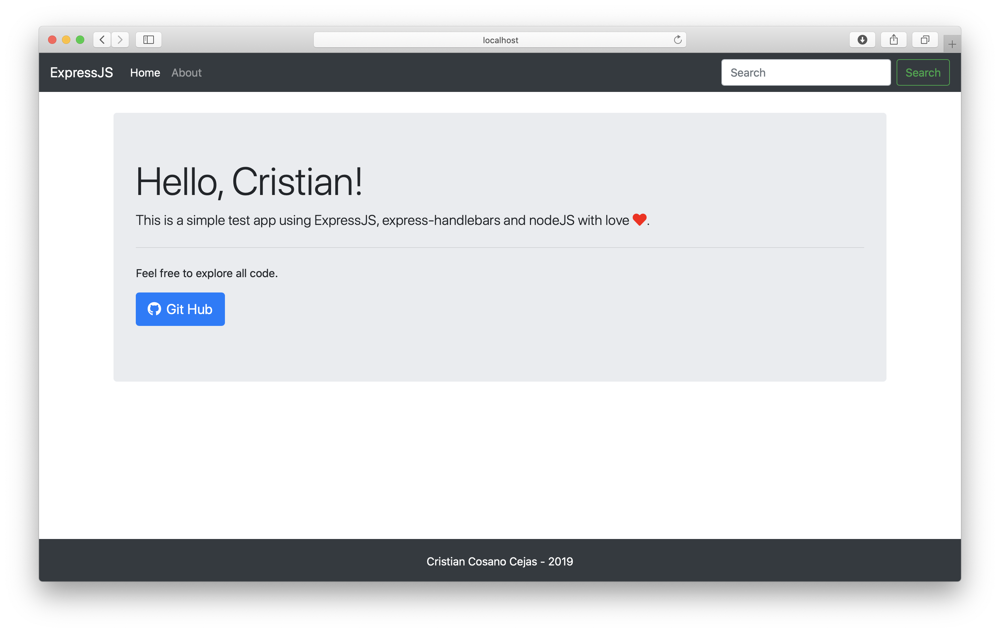

# Sampe Node.js Web App

Simple application to test Node.js, Express.js and Handlebars.

#### Init

To start the project run `npm install`, to resolve the dependencies

#### Examples

`$ node app `  --> Server starts and you can access it in localhost:3000

